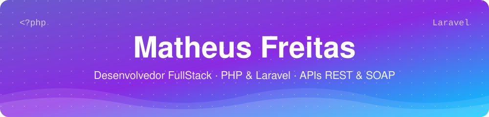
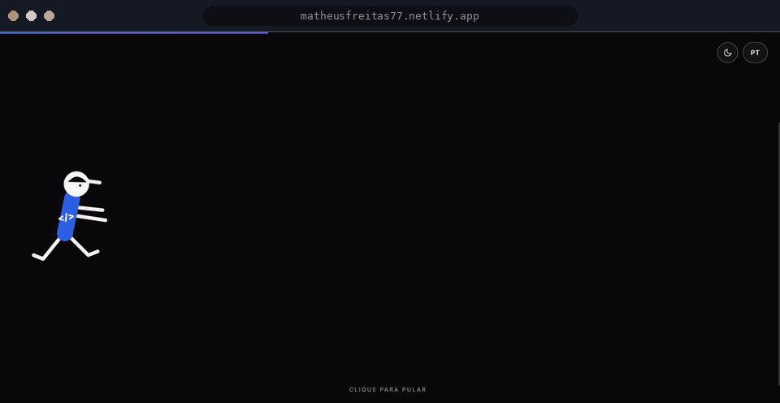
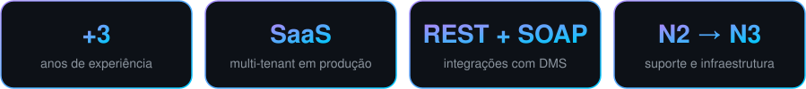

<div align="center">




<br/><br/>

<a href="https://matheusfreitas77.netlify.app/"></a>
<a href="https://www.linkedin.com/in/seu-linkedin"></a>
<a href="mailto:seuemail@gmail.com"></a>


</div>

<br/>

<div align="center">

## Meu Portfólio

<a href="https://matheusfreitas77.netlify.app/">
  
</a>

<sub>Clique na prévia para abrir o portfólio completo</sub>

<br/><br/>



</div>

<br/>

## Sobre mim

```php
<?php

class Matheus extends Developer
{
    public string $role       = 'Desenvolvedor Backend';
    public string $location   = 'Minas Gerais, BR';
    public int    $experience = 3; // anos+

    public array $focus = [
        'Plataformas SaaS multi-tenant',
        'Integrações críticas via API REST e SOAP (DMS)',
        'Diagnóstico e correção de bugs em produção',
        'Refatoração de código legado com estabilidade',
    ];

    public function philosophy(): string
    {
        return 'Seguir o dado até a origem, em vez de assumir onde ele quebrou.';
    }
}
```

<br/>

## Stack

<div align="center">


</div>

| Camada | Tecnologias |
| :-- | :-- |
| **Backend** | PHP, Laravel, Node.js, C# (servidor de integração) |
| **Integrações** | API REST, SOAP, Postman |
| **Frontend** | HTML, CSS, JavaScript, TypeScript, Vue.js |
| **Dados** | MySQL, PostgreSQL, MongoDB |
| **Infra** | Docker, Git, redes e suporte N2/N3 |

<br/>

## Cases técnicos

> Problemas reais de produção que diagnostiquei e corrigi. Detalhes de clientes omitidos por confidencialidade.

<details>
<summary><b>Data de saída em branco no PDF da OS</b></summary>
<br/>

**Sintoma:** a assinatura de saída era gravada, mas data e hora saíam vazias no PDF.

**Causa raiz:** registros duplicados para a mesma OS. O controller buscava sempre o mais recente por chave interna, sem filtrar pelo número da OS, e esse registro era a duplicata incompleta.

**Aprendizado:** o bug "no PDF" nunca esteve no PDF. Seguir o dado até a origem evitou uma refatoração desnecessária.

`Laravel` `SQL` `Eloquent` `Debug em produção`

</details>

<details>
<summary><b>Falha de autenticação SOAP com DMS</b></summary>
<br/>

**Sintoma:** duas lojas do mesmo grupo recebiam erro de senha inválida com o mesmo login que funcionava nas demais.

**Causa raiz:** o DMS valida a credencial junto com o documento da empresa, e o cadastro dessas lojas apontava para outra filial.

**Entrega:** relatório técnico apontando exatamente qual cadastro corrigir, sem alteração de código.

`SOAP` `Postman` `Integração DMS` `Documentação`

</details>

<details>
<summary><b>Cache de fallback para instabilidade do DMS</b></summary>
<br/>

**Problema:** o sistema caía junto com a integração quando o DMS ficava instável.

**Solução:** cache de fallback, para que a tela nunca quebre mesmo com o DMS fora do ar.

</details>

<div align="center">
<a href="https://matheusfreitas77.netlify.app/"><sub>Ver todos os cases no portfólio →</sub></a>
</div>

<br/>

## Galeria de projetos

<table>
  <tr>
    <td width="50%" valign="top">
      <h4>Dashboard Financeiro</h4>
      Análise financeira com visualização de dados em tempo real e relatórios personalizados.<br/><br/>
      
    </td>
    <td width="50%" valign="top">
      <h4>Loja Virtual</h4>
      E-commerce completo com carrinho, checkout e integração com pagamentos.<br/><br/>
      
    </td>
  </tr>
  <tr>
    <td width="50%" valign="top">
      <h4>Sistema de Folha de Ponto</h4>
      Registro e gestão de horas de funcionários, com relatórios de produtividade.<br/><br/>
      
    </td>
    <td width="50%" valign="top">
      <h4>Gestão para Barbearia</h4>
      Agendamento de horários, controle de clientes e gerenciamento de serviços.<br/><br/>
      
    </td>
  </tr>
</table>

<br/>

<div align="center">

## Vamos conversar?

Disponível para oportunidades e colaborações em projetos desafiadores.

<a href="https://matheusfreitas77.netlify.app/"></a>
<a href="https://www.linkedin.com/in/seu-linkedin"></a>
<a href="mailto:seuemail@gmail.com"></a>

<br/><br/>


</div>
